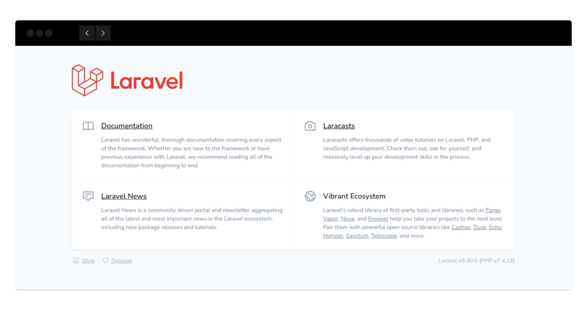

## Imagem / Container Laravel 
> Script automatizado para criar containers Laravel

### Como executar
1. Fazer build da imagem
```sh
docker build -t imagemlaravel .
```

2. Tornar script executável
```sh
chmod +x run_container.sh
``` 

3. Subir container
```sh
./run_container.sh
```

4. Acesse em
```sh
http://localhost:8085
```

## Screenshot
